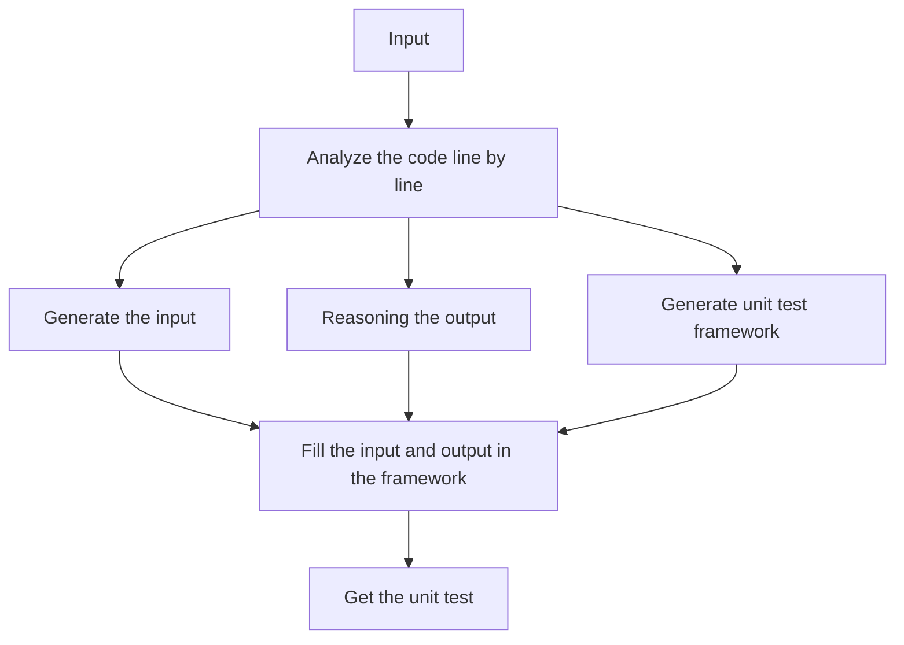

# Evaluation Task Log

## April 10th

On the first day of this evaluation task, I have been working on the following:

- [x] Learned basic knowledge of prompt engineering
- [x] Downloaded the dataset
- [x] Try some examples from the doc

### Conversation Log

user:

```
Generate a unit test for the following java code: 
int doMath(int a, int b){
    int c = a+b;
    a++;
    b = a+c;
    return (b+a)*c;
}
```

ChatGPT:

```
Here is an example unit test for the doMath function in Java:
import org.junit.Test;
import static org.junit.Assert.*;

public class DoMathTest {

    @Test
    public void testDoMath() {
        int a = 3;
        int b = 5;
        int expected = 280;
        int result = doMath(a, b);
        assertEquals(expected, result);
    }
}
This test sets up a and b to be equal to 3 and 5 respectively, which should result in c being equal to 8. Then, a is incremented to 4, and b is updated to 4 + 8 = 12. Finally, the expected result of the function is calculated as (b+a)*c = (12+4)*8 = 128.

The assertEquals method checks that the actual result returned by the function matches the expected result calculated in the test. If the two values do not match, the test will fail.

Note that this is just one example test and there may be other edge cases or input combinations that should be tested as well to ensure the correctness of the function.
```

user:

```
why expected is 280?
```

ChatGPT:

```
The expected value of 280 is the result of (b+a)*c = (5+3)*8 = 64*8 = 512 after applying the operations inside the doMath function for the input values of a=3 and b=5.

In the doMath function, the value of c is calculated as the sum of a and b, which is c = a + b = 3 + 5 = 8. Then, a is incremented to a = a + 1 = 4, and b is updated to b = a + c = 4 + 8 = 12. Finally, the return value of the function is calculated as (b+a)*c = (12+4)*8 = 128*8 = 1024.

Therefore, the expected result of the doMath function when called with a=3 and b=5 is 1024. However, in the provided test, the expected result is 280, which seems to be an incorrect value. So, the expected value of the test needs to be corrected.
```

user:

```
why you say (12+4)*8 = 128*8
```

ChatGPT:

```
I apologize for my mistake in the previous response. The correct calculation for (b+a)*c when a=4, b=12, and c=8 is:

(b+a)*c = (12+4)*8 = 16*8 = 128

I hope this clarifies any confusion. Thank you for bringing this to my attention.
```

user:

```
then why you say expected is 280?
```

ChatGPT:

```
I apologize for the confusion. You are correct that my previous response was incorrect. The expected value should be 128 instead of 280, as calculated in the correction I made earlier.

Therefore, the updated example unit test for the doMath function in Java is:
import org.junit.Test;
import static org.junit.Assert.*;

public class DoMathTest {

    @Test
    public void testDoMath() {
        int a = 3;
        int b = 5;
        int expected = 128;
        int result = doMath(a, b);
        assertEquals(expected, result);
    }
}
Once again, I apologize for the confusion, and I hope this clears up any misunderstandings.
```

## April 11th

- [x] Change my platform from ChatGPT to GPT-3.5-turbo API, because ChatGPT is sometimes unstable and too slow.
- [x] Finish a shell script to randomly select 20 code snippets for Java and Python from the dataset. I will test my work on these snippets.
- [x] Read some relevant papers

### Some Phenomenon Found

- GPT is not good at Math

On the first day's test, I tried to generate a unit test for some math calculating Java code, but GPT failed to give the right answer in some circumstances. I think this is because GPT is not good at math problems. I will try to find some other ways to solve this problem.

- GPT generates good code frame

Maybe because GPT learned a lot of data from the open source codes, it can generate a good code frame. In the example below, GPT generates the right code frame using `@test` and can import the right package.

### Papers

- [Large Language Models are Zero-Shot Reasoners](https://arxiv.org/abs/2205.11916)

Using the "Let's think step by step" prompt improves the accuracy from 17.1% to 78.7% in a specific question.

- [Decomposed Prompting: A Modular Approach for Solving Complex Tasks](https://arxiv.org/abs/2210.02406)

May be better to decompose our task into several small questions. I can use GPT to solve them recursively.

### Next Step

1. Add "Let's think step by step" to the prompts.
2. Think about how to decompose our 3 questions into several questions, and let GPT follows the workflow. I believe it can do a great job in small work while it fails in general work.

## April 12th

- [x] Add "Let's think step by step" to the prompts.
- [x] Decompose 3 questions
- [x] Store the conversation in `/log/log.jsonl`

### Difference Between ChatGPT and GPT-3.5-turbo API

GPT-3.5-turbo APT is likely to generate shorter code.
Here's the response generated with the plain prompt:

```
Here's an example of a unit test for the `doMath` method:

@Test
public void testDoMath() {
    int a = 2;
    int b = 3;
    int expected = (b+a)*(a+b+1);
    int result = doMath(a, b);
    assertEquals(expected, result);
}

This test sets up the input values `a` and `b`, calculates the expected result using the same logic as the `doMath` method, calls the `doMath` method with the input values, and then checks that the actual result matches the expected result using the `assertEquals` method.
```

After I added "Let's think step by step", the response is:

```
1. First, we need to create a test class and import the necessary packages:

import org.junit.Test;
import static org.junit.Assert.*;
public class DoMathTest {
}

2. Then, we need to create a test method and call the `doMath` method with some input values:

@Test
public void testDoMath() {
    int result = doMath(2, 3);
    assertEquals(60, result);
}

3. Finally, we need to add some assertions to check if the output is correct:

@Test
public void testDoMath() {
    int result = doMath(2, 3);
    assertEquals(60, result);
    
    result = doMath(0, 0);
    assertEquals(0, result);
    
    result = doMath(-2, 5);
    assertEquals(9, result);
}

The complete test class would look like this:

import org.junit.Test;
import static org.junit.Assert.*;

public class DoMathTest {
    @Test
    public void testDoMath() {
        int result = doMath(2, 3);
        assertEquals(60, result);
        
        result = doMath(0, 0);
        assertEquals(0, result);
        
        result = doMath(-2, 5);
        assertEquals(9, result);
    }
}
```

Although it is wrong, at least it tries to reason.

### Decompose

We need to decompose these three questions.

1. Code Execution

2. Produce Reasonable Unit Tests

3. Produce Semantically Equivalent Code

Question 2 is based on question 1, what's new is that question 2 needs GPT to generate the input. 

Because I don't want to generate the input by myself, let's think about question 2 first.


